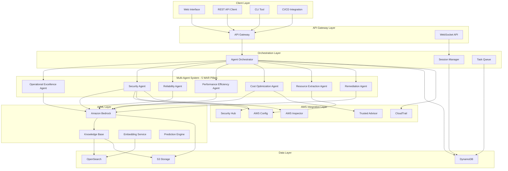
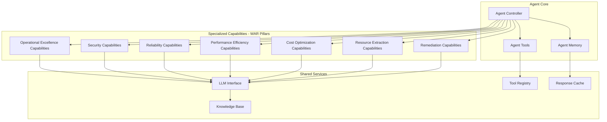

# Design Document

## Overview

The AWS Well Architected Analyzer Bot is a sophisticated multi-agent AI system that provides comprehensive analysis of AWS architectures against the Well-Architected Framework. The system employs a microservices architecture with specialized AI agents, each responsible for specific analysis domains (Security, Cost Optimization, Building Blocks, and Remediation). The system integrates with AWS services through APIs and provides both real-time analysis and continuous monitoring capabilities.

The architecture leverages Amazon Bedrock for AI capabilities, AWS Lambda for serverless compute, Amazon DynamoDB for state management, and Amazon OpenSearch for knowledge base operations. The system supports multiple interfaces including REST APIs, WebSocket connections for real-time updates, and a conversational chat interface.

## Architecture

### High-Level Architecture



### Agent Architecture



## Components and Interfaces

### 1. Agent Orchestrator

**Purpose**: Coordinates multi-agent workflows and manages agent communication

**Key Responsibilities**:
- Route analysis requests to appropriate agents
- Manage agent lifecycle and resource allocation
- Aggregate results from multiple agents
- Handle error recovery and failover scenarios

**Interface**:
```python
class AgentOrchestrator:
    def analyze_architecture(self, architecture_data: Dict, analysis_type: str) -> AnalysisResult
    def get_agent_status(self, agent_id: str) -> AgentStatus
    def coordinate_agents(self, task: Task) -> CoordinationResult
    def handle_agent_failure(self, agent_id: str, error: Exception) -> RecoveryAction
```

### 2. Operational Excellence Agent

**Purpose**: Analyzes operational practices, automation, and monitoring capabilities

**Key Capabilities**:
- Infrastructure as Code assessment
- Automation and deployment pipeline analysis
- Monitoring and observability evaluation
- Operational procedures and runbooks validation

**Interface**:
```python
class OperationalExcellenceAgent:
    def analyze_automation_level(self, resources: List[AWSResource]) -> AutomationAnalysis
    def evaluate_monitoring(self, architecture: Architecture) -> MonitoringAssessment
    def assess_deployment_practices(self, cicd_config: CICDConfiguration) -> DeploymentAnalysis
    def generate_operational_recommendations(self, findings: List[Finding]) -> List[Recommendation]
```

### 3. Security Agent

**Purpose**: Analyzes security posture and compliance against AWS security best practices

**Key Capabilities**:
- Security vulnerability detection
- Compliance gap analysis
- Risk assessment and scoring
- Identity and access management evaluation

**Interface**:
```python
class SecurityAgent:
    def analyze_security_posture(self, resources: List[AWSResource]) -> SecurityAnalysis
    def check_compliance(self, framework: ComplianceFramework) -> ComplianceReport
    def assess_risks(self, architecture: Architecture) -> RiskAssessment
    def evaluate_iam_policies(self, iam_resources: List[IAMResource]) -> IAMAnalysis
```

### 4. Reliability Agent

**Purpose**: Evaluates system resilience, fault tolerance, and disaster recovery capabilities

**Key Capabilities**:
- Multi-AZ and multi-region analysis
- Backup and disaster recovery assessment
- Auto-scaling and load balancing evaluation
- Fault tolerance pattern identification

**Interface**:
```python
class ReliabilityAgent:
    def analyze_fault_tolerance(self, architecture: Architecture) -> FaultToleranceAnalysis
    def evaluate_backup_strategy(self, resources: List[AWSResource]) -> BackupAssessment
    def assess_scaling_capabilities(self, scaling_config: ScalingConfiguration) -> ScalingAnalysis
    def check_disaster_recovery(self, dr_config: DRConfiguration) -> DRAnalysis
```

### 5. Performance Efficiency Agent

**Purpose**: Analyzes system performance, resource utilization, and optimization opportunities

**Key Capabilities**:
- Resource sizing and utilization analysis
- Performance bottleneck identification
- Technology selection evaluation
- Caching and content delivery assessment

**Interface**:
```python
class PerformanceEfficiencyAgent:
    def analyze_resource_utilization(self, metrics: PerformanceMetrics) -> UtilizationAnalysis
    def identify_bottlenecks(self, architecture: Architecture) -> BottleneckAnalysis
    def evaluate_technology_choices(self, tech_stack: TechnologyStack) -> TechnologyAssessment
    def assess_caching_strategy(self, caching_config: CachingConfiguration) -> CachingAnalysis
```

### 6. Cost Optimization Agent

**Purpose**: Identifies cost optimization opportunities and provides savings recommendations

**Key Capabilities**:
- Resource utilization analysis
- Cost anomaly detection
- Rightsizing recommendations
- Reserved instance and savings plan optimization

**Interface**:
```python
class CostOptimizationAgent:
    def analyze_cost_efficiency(self, billing_data: BillingData) -> CostAnalysis
    def identify_waste(self, resources: List[AWSResource]) -> List[WasteOpportunity]
    def recommend_optimizations(self, usage_patterns: UsagePatterns) -> List[CostRecommendation]
    def calculate_savings_potential(self, recommendations: List[Recommendation]) -> SavingsEstimate
```

### 7. Resource Extraction Agent

**Purpose**: Extracts and inventories AWS resources from specified accounts and regions

**Key Capabilities**:
- Multi-account resource discovery
- Tag-based resource filtering
- Resource relationship mapping
- Real-time resource state monitoring

**Interface**:
```python
class ResourceExtractionAgent:
    def extract_resources(self, account_id: str, regions: List[str], tags: Dict[str, str]) -> ResourceInventory
    def map_resource_relationships(self, resources: List[AWSResource]) -> ResourceGraph
    def filter_by_tags(self, resources: List[AWSResource], tag_filters: Dict[str, str]) -> List[AWSResource]
    def monitor_resource_changes(self, resource_ids: List[str]) -> ChangeStream
```

### 8. Remediation Agent

**Purpose**: Creates actionable remediation plans with step-by-step procedures

**Key Capabilities**:
- Cross-pillar remediation plan generation
- Task prioritization and sequencing
- Progress tracking and validation
- Infrastructure as Code template generation

**Interface**:
```python
class RemediationAgent:
    def create_remediation_plan(self, findings: List[Finding]) -> RemediationPlan
    def prioritize_tasks(self, tasks: List[Task], constraints: Constraints) -> List[PrioritizedTask]
    def generate_iac_templates(self, recommendations: List[Recommendation]) -> List[IaCTemplate]
    def track_progress(self, plan_id: str) -> ProgressReport
```

### 6. Knowledge Base Service

**Purpose**: Manages RAG operations and maintains up-to-date AWS documentation

**Key Capabilities**:
- Document ingestion and processing
- Vector similarity search
- Knowledge retrieval and ranking
- Content freshness validation

**Interface**:
```python
class KnowledgeBaseService:
    def ingest_documents(self, documents: List[Document]) -> IngestionResult
    def search_knowledge(self, query: str, filters: Dict) -> List[KnowledgeItem]
    def update_knowledge_base(self, updates: List[DocumentUpdate]) -> UpdateResult
    def validate_content_freshness(self) -> FreshnessReport
```

### 7. AWS Integration Service

**Purpose**: Interfaces with AWS services to gather architecture data

**Key Capabilities**:
- Multi-service data collection
- API rate limit management
- Data normalization and correlation
- Real-time change detection

**Interface**:
```python
class AWSIntegrationService:
    def collect_architecture_data(self, account_id: str, regions: List[str]) -> ArchitectureData
    def monitor_changes(self, resources: List[str]) -> ChangeStream
    def normalize_data(self, raw_data: Dict) -> NormalizedData
    def correlate_findings(self, findings: List[Finding]) -> CorrelatedFindings
```

## Data Models

### Core Data Models

```python
@dataclass
class Architecture:
    id: str
    name: str
    description: str
    resources: List[AWSResource]
    relationships: List[ResourceRelationship]
    metadata: Dict[str, Any]
    created_at: datetime
    updated_at: datetime

@dataclass
class AWSResource:
    resource_id: str
    resource_type: str
    service: str
    region: str
    configuration: Dict[str, Any]
    tags: Dict[str, str]
    compliance_status: ComplianceStatus

@dataclass
class AnalysisResult:
    analysis_id: str
    architecture_id: str
    agent_results: Dict[str, AgentResult]
    overall_score: float
    recommendations: List[Recommendation]
    created_at: datetime
    status: AnalysisStatus

@dataclass
class Recommendation:
    id: str
    title: str
    description: str
    priority: Priority
    impact: Impact
    effort: Effort
    pillar: WellArchitectedPillar
    implementation_steps: List[str]
    iac_templates: List[IaCTemplate]
    estimated_savings: Optional[float]

@dataclass
class Finding:
    id: str
    resource_id: str
    finding_type: FindingType
    severity: Severity
    description: str
    evidence: Dict[str, Any]
    remediation_guidance: str
    compliance_frameworks: List[str]
```

### Agent-Specific Models

```python
@dataclass
class ResourceInventory:
    account_id: str
    regions: List[str]
    resources: List[AWSResource]
    resource_graph: ResourceGraph
    extraction_timestamp: datetime
    tag_filters_applied: Dict[str, str]

@dataclass
class OperationalExcellenceAnalysis:
    automation_score: float
    monitoring_coverage: float
    deployment_maturity: DeploymentMaturity
    operational_recommendations: List[OperationalRecommendation]

@dataclass
class SecurityAnalysis:
    vulnerabilities: List[SecurityVulnerability]
    compliance_gaps: List[ComplianceGap]
    risk_score: float
    iam_findings: List[IAMFinding]
    security_recommendations: List[SecurityRecommendation]

@dataclass
class ReliabilityAnalysis:
    fault_tolerance_score: float
    backup_coverage: float
    disaster_recovery_readiness: DRReadiness
    reliability_recommendations: List[ReliabilityRecommendation]

@dataclass
class PerformanceAnalysis:
    utilization_metrics: UtilizationMetrics
    bottlenecks: List[PerformanceBottleneck]
    technology_assessment: TechnologyAssessment
    performance_recommendations: List[PerformanceRecommendation]

@dataclass
class CostAnalysis:
    total_monthly_cost: float
    waste_opportunities: List[WasteOpportunity]
    optimization_potential: float
    cost_recommendations: List[CostRecommendation]

@dataclass
class RemediationPlan:
    plan_id: str
    pillar_tasks: Dict[str, List[RemediationTask]]
    estimated_duration: timedelta
    dependencies: List[TaskDependency]
    iac_templates: List[IaCTemplate]
    rollback_procedures: List[RollbackStep]
```

## Error Handling

### Error Categories and Strategies

1. **Agent Failures**
   - Implement circuit breaker pattern for agent communication
   - Graceful degradation when agents are unavailable
   - Automatic retry with exponential backoff
   - Fallback to cached results when appropriate

2. **AWS API Errors**
   - Rate limit handling with intelligent backoff
   - Permission error detection and user guidance
   - Service unavailability handling
   - Data consistency validation

3. **Knowledge Base Errors**
   - Vector search fallback mechanisms
   - Content staleness detection and alerts
   - Embedding service error handling
   - Query optimization for performance

4. **User Input Validation**
   - Architecture data validation
   - Custom lens validation
   - Query sanitization and safety checks
   - Input format standardization

### Error Recovery Mechanisms

```python
class ErrorHandler:
    def handle_agent_failure(self, agent_id: str, error: Exception) -> RecoveryAction:
        if isinstance(error, TemporaryFailure):
            return self.retry_with_backoff(agent_id)
        elif isinstance(error, ResourceExhaustion):
            return self.scale_agent_resources(agent_id)
        else:
            return self.failover_to_backup_agent(agent_id)
    
    def handle_aws_api_error(self, service: str, error: Exception) -> APIRecoveryAction:
        if error.response['Error']['Code'] == 'Throttling':
            return self.implement_backoff_strategy(service)
        elif error.response['Error']['Code'] == 'AccessDenied':
            return self.request_permission_escalation(service)
        else:
            return self.log_and_continue(service, error)
```

## Testing Strategy

### Unit Testing
- Individual agent logic testing
- Mock AWS service responses
- Knowledge base query testing
- Data model validation testing

### Integration Testing
- Multi-agent workflow testing
- AWS service integration testing
- End-to-end analysis pipeline testing
- Real-time monitoring validation

### Performance Testing
- Load testing with concurrent analysis requests
- Scalability testing with large architectures
- Response time optimization
- Memory usage profiling

### Security Testing
- Input validation and sanitization
- Authentication and authorization testing
- Data encryption validation
- Compliance framework verification

### Test Implementation Framework

```python
class AgentTestFramework:
    def setup_test_environment(self):
        # Mock AWS services
        # Initialize test knowledge base
        # Create test architectures
        pass
    
    def test_agent_analysis(self, agent: Agent, test_data: TestData):
        # Execute agent analysis
        # Validate results against expected outcomes
        # Check performance metrics
        pass
    
    def test_multi_agent_coordination(self, test_scenario: TestScenario):
        # Simulate multi-agent workflow
        # Validate agent communication
        # Check result aggregation
        pass
```

### Continuous Testing Strategy

1. **Automated Testing Pipeline**
   - Unit tests on every commit
   - Integration tests on pull requests
   - Performance regression testing
   - Security vulnerability scanning

2. **Monitoring and Alerting**
   - Real-time error rate monitoring
   - Performance metric tracking
   - User experience monitoring
   - System health dashboards

3. **A/B Testing Framework**
   - Recommendation effectiveness testing
   - User interface optimization
   - Agent performance comparison
   - Feature rollout validation

## Integration with Existing Solution

The design will build upon the existing ArchitectureAnalyzerBot solution by converting its functionality into an agent-based architecture. The new implementation will be organized in the following structure:

```
ArchitectureAnalyzerBot/
├── ArchitectureAnalyzerBot.py (existing solution)
└── Agentic/
    ├── core/
    │   ├── agent_base.py
    │   ├── orchestrator.py
    │   ├── session_manager.py
    │   └── knowledge_base.py
    ├── agents/
    │   ├── operational_excellence_agent.py
    │   ├── security_agent.py
    │   ├── reliability_agent.py
    │   ├── performance_efficiency_agent.py
    │   ├── cost_optimization_agent.py
    │   ├── resource_extraction_agent.py
    │   └── remediation_agent.py
    ├── services/
    │   ├── aws_integration_service.py
    │   ├── bedrock_service.py
    │   └── report_generator.py
    ├── models/
    │   ├── data_models.py
    │   ├── analysis_models.py
    │   └── recommendation_models.py
    ├── utils/
    │   ├── error_handler.py
    │   ├── validators.py
    │   └── formatters.py
    └── tests/
        ├── unit/
        ├── integration/
        └── performance/
```

### Migration Strategy

1. **Extract Core Functionality**: Identify reusable components from the existing solution
2. **Agent Conversion**: Transform existing analysis logic into specialized agents
3. **API Compatibility**: Maintain backward compatibility with existing interfaces
4. **Gradual Migration**: Support both legacy and agent-based approaches during transition

### Enhanced Input Processing

The Resource Extraction Agent will accept:
- **Account ID**: Target AWS account for resource discovery
- **Regions**: List of AWS regions to scan
- **Tag Filters**: Key-value pairs for resource filtering
- **Resource Types**: Specific AWS service types to include/exclude
- **Custom Lenses**: Organization-specific evaluation criteria

### Output Enhancements

The system will generate:
- **Pillar-specific Reports**: Detailed analysis for each Well-Architected pillar
- **Cross-pillar Insights**: Correlations and dependencies between pillars
- **Actionable Remediation Plans**: Step-by-step implementation guides
- **IaC Templates**: Ready-to-deploy infrastructure code
- **Progress Tracking**: Implementation status and validation

The design provides a robust, scalable foundation for the AWS Well Architected Analyzer Bot, with clear separation of concerns, comprehensive error handling, and thorough testing strategies to ensure reliable operation in production environments.
